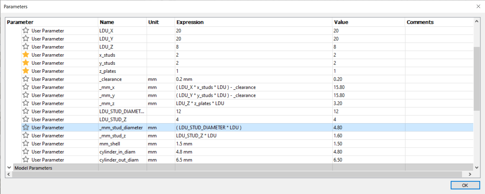

## Introduction

As a software developer I value having an iterative and incremental development approach for building software. A process which seeks to answer not only "what" we are building but also "how" we are building it. An approach which has been developed for decades and has many implementations. I naively hoped to find such a process for additive manufacturing but haven't yet. What I did find were many text and video tutorials on how to set up the printer, use the basic functions of a CAD software to create a model, use the model for creating a file that can be consumed by the printer and finally refine the print by various hardware and software settings and upgrades. Which led me to a first general approach to additive manufacturing:

    1 Make the printer work.
    2 (Re)Make a 3D model.
    3 Print the model.
    4 If the manufactured part is not good then goto 1
    5 Model successfully manufactured.

It took time to figure out each of the previously mentioned steps but the question still remained, "Is there a general method for additive manufacturing that will help to produce a part which will be assembled with other parts?". Could the above process be formalized into some kind of reproducible iterative development process?

To answer the question I decided to explore the manufacturing process of a Lego compatible brick. The challenge being to create a CAD model which could be used for manufacturing a brick with low dimensional tolerance and allowances. Thus, the model has to be parameterized in order to make refinements between iterations to conform with the inherent mechanical and manufacturing limitations of using an FFF printer.

## Previous Work

A very good article at prusaprinters.org illustrates the challenges of printing Lego compatible parts. The article mentions the difficulty of finding good models for printing and provides a set of STL models of bricks for printing. Yet, STL models in general are difficult to modify and not usable as a starting point in this project.  Also, it is not clear if the offered models can be used in different printers since they were created using only one specific model of Prusa brand printer. Yet, the article is very informative and should be kept in mind because of the information about how approach the problem of printing blocks.

For this project we need to start with a CAD model and not an STL. It is not easy to find proper CAD models of bricks for printing. Although it is easy to find CAD models from public sources such as GrabCAD and industry CAD model providers. But, the available models are mostly meant to be for use within a CAD and not for 3D printing bricks. Thus we must construct our own model in a CAD. Various video tutorials on YouTube explain how to design a Lego brick using various CAD software. Yet, the major hinderance of CAD models found in public sources is the lack of detail and/or agreement on the dimensions of a Lego brick.

"LDraw is a completely unofficial, community run free CAD system which represents official parts produced by the LEGO company." The community has a very well defined file format for sharing models made of Lego parts. The key feature of the file format is the definition of a standard unit of measurement named "LDraw Unit" or "LDU". A LDU is defined to be 0.4 mm. In the figure we see a 1x1 brick dimensioned with LDU where the width of the brick is 20 LDU or 8 mm.  The LDU gives us an easy way to manage dimension calculations using integer values and is well suited for building a parameterized model in a CAD. For example, a Lego plate height is defined as 8 LDU or 3.2 mm while the height of a standard brick is 3 plates or 24 LDU or 9.6 mm. The caveat of using LDU is that it is an approximation of the measured dimensions of Lego brick, eg. the there is a 0.2 mm less on the side of a Lego brick as a tolerance. The width of a 1x1 brick if measured would be 20 LDU - 0.2 mm which is 7.8 mm.

Ootus, a contributor at instructables.com, has constructed a parameterized model in Fusion 360 which can be used for generating basic brick parts of different regular sizes. The sizes of the bricks are defined by three parameters: number of studs in the x direction, number of studs in the y direction and the plate height in the z direction. The model uses 8 mm as the unit of length and not LDU. The model does take into account the measured dimensions of a Lego brick and works quite well in producing different sized bricks.

 Finally, it is noteworthy to mention the work of Yip-Hoi, D. M., & Newcomer, J. L. whom describe the use of Lego for teaching CAD software with the intent for students to design and manufacture parts using a FFF printer.

## Approach

### Setup

The CAD software used is Fusion 360. The slicer is Ultimaker Cura 4.9.1 using the default profile for the Creality Ender 3. A stock Creality Ender 3 v2 with a 0.4 mm nozzle and a generic PLA filament is used for manufacturing.  Measurements of the prints are done with a Mitutoyo 530-122 Vernier Caliper with a precision of 0.02 mm. 

#### Design model, Manufacturing model and product model

There are three models: a design model, a manufacturing model and a product model. The design model defines the ideal product. The manufacturing model is used to define the input for the FFF printer. It will vary from the desired product model and it is a representation of the capabilities and limitation any a particular FFF printer.  Although, the product from the manufacturing model might be the desired product model or an acceptable approximation. The product model represent the real dimensions of the manufactured product. Here product model is a physical Lego brick

### Iteration

The method of an iteration is a repetitive set of steps with the goal of having a refined product as compared to the product of the previous iteration. There is no set number of optimal number of iterations. The number of iterations may be considered as a limit which is approached by refining the precision and accuracy of the dimensions of the iteration product, the manufacturing model, as compared to the dimensions of the  desired product, the product model. . The CAD model is the design model. The manufacturing is used to define and refine the manufactured piece at the beginning of each iteration.

## Development Iterations

There were two iterations for this project:
1. Calibration Iteration
2. Manufacturing Iteration

Each iteration was further divided into small goal oriented Sprints. The identification numbering system used is: 

__[Iteration Number].[Sprint Number]__

The numbering system starts at index = 1.

### Iteration 1.1 - Calibration

Two 20x20 mm cube were printing without support using the "Standard" profiles in Cura for the Creality Ender 3. The 

#### Table 1. Measured axis mm, Expected axis mm and Error Percent 

| Profile Name     | Meas X mm      | Exp X mm    | Percent Error |
|:-----------------|:-------------:|:------------:|:-------------:|
| Standard Quality | 19.96         | 20.00        | 0.2           |

| Profile Name     | Meas Y mm      | Exp Y mm    | Percent Error |
|:-----------------|:-------------:|:------------:|:-------------:|
| Standard Quality | 20.02         | 20.00        | 0.1           |

| Profile Name     | Meas Z mm      | Exp Z mm    | Percent Error |
|:-----------------|:-------------:|:------------:|:-------------:|
| Standard Quality | 19.92         | 20.00        | 0.4           |

The X and Y error is good enough and prove the printer hardware or the slicer setting should be changed. The error for the Z axis is accounted by the slicing software layer height setting: number of layers * layer height = total height :: 166 layers * 0.12 mm/layer = 19.92 mm. The calibrations of good enough to proceed to the next iteration.

### Iteration 1.1 - 2x2 plate print using the dimensions from Ootus

The design model created by Ootus serves as the baseline. It is well constructed given the dimensions of the plans he used. Here we print a 2x2 plate and test its connectivity to a 4x2 Lego brick. 

#### Dimensions of the product

The only discrepancy between the 3D model and the product is the diameter of the studs where in the model the diameter is 4.8 mm while in the product it is 4.7 mm.

#### Connectivity between the 2x2 plate studs to the 4x2 brick

The connectivity to the bottom of the Lego brick is not possible due to the small diameter of the studs. The difference between the 3D model and the product diameter is caused the by accumulated rounding and systematic errors from creation of the STL mesh and the slicer. The errors can be compensated by adding small compensation to the diameter of the stud in the design model. It is very important to note that the measures stud diameter of a 4x2 Lego block is 4.88 mm.

#### Connectivity between the 4x2 Lego studs to the 2x2 plate

The connectivity to the studs of the 4x2 Lego brick is tight. The wall thickness of 1.6 mm is too thick by 0.1 mm. Also, the top of the inside is too low by 0.1 mm and thus the plate bottom edge is not flush with the brick.

### Iteration 2.1 - New parametric model in Fusion 360

A new design model was made which uses the LDU as a base unit and with parameters for almost every dimension of the part. The idea is to use the LDU as a base unit of measurement in the parameter equations. Needed changes to the model due to differences due to the manufactured of the parts and be introduced as magic numbers or parameters without changing the base LDU parametric equations.

### Iteration 3.1 - 2x2 with 0.15 added to the diameter

### Iteration 3.2 - 2x2 with 0.20 added to the diameter

### Iteration 4.1 - 4x2 brick

The 4x2 brick connectivity was good for the top and bottom. Although, the side walls did sag inward at the point where the top side meets the side walls. Further correction can be done by providing internal support at the union point of the top with the side wall.

## Conclusion

Here it is shown a way to produce Lego compatible parts using a 3D printer. The parts are not as dimensionally exact to Lego parts but they can be used. A further refinement could be the usage of a 0.2 mmm nozzle on the printer. The take away is that using an iterative design and manufactured process can greatly help in achieving a good final result by focusing on small changes. Here we recommend focusing first on the design model first and then consecutively on the manufacturing and product model.  

## References

- [How to make 3D printed LEGO and LEGO Duplo parts](https://blog.prusaprinters.org/how-to-make-3d-printed-lego-and-lego-duplo-parts_31741/)

### Dimensions

- [LEGO Brick Dimensions and Measurements](http://www.bartneck.de/2019/04/21/lego-brick-dimensions-and-measurements/)
- [LDraw File Format Specification](https://www.ldraw.org/article/218.html)

### CAD

[Parametric Lego Bricks in Fusion 360](https://www.instructables.com/Parametric-Lego-Bricks-in-Fusion-360/)

#### Education
- [Yip-Hoi, D. M., & Newcomer, J. L. (2011, June), Teaching CAD Modeling Using
LEGO Paper presented at 2011 ASEE Annual Conference & Exposition, Vancouver, BC.
10.18260/1-2--18586](https://peer.asee.org/teaching-cad-modeling-using-lego) has dimensions for brick manufacturing

